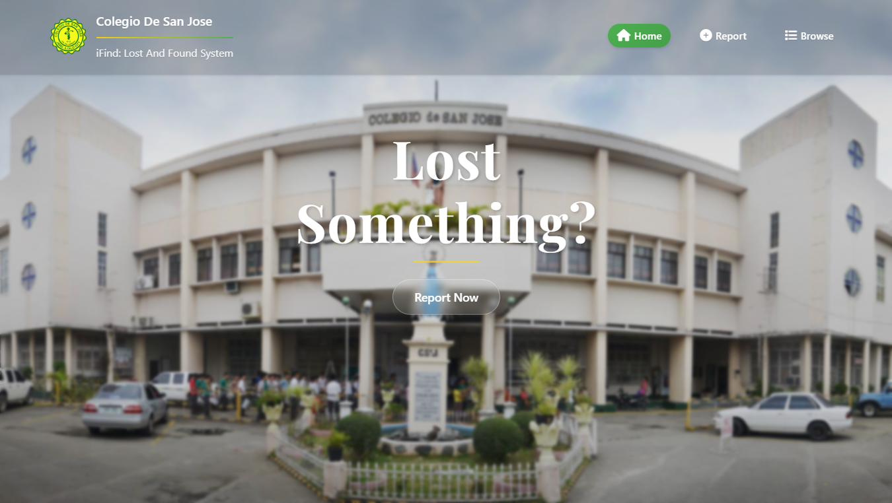

# 🏫 iFind: Lost and Found System

**iFind: A Web-Based Lost and Found System for Colegio de San Jose – Grade 12 ICT Project**

---

## 📖 Description
This repository contains the **frontend** of **iFind**, a web-based lost and found system created as part of the **Grade 12 ICT project** at **Colegio de San Jose**.  
The system helps students, faculty, and staff to report, view, and track lost and found items inside the school campus.

---

## 🌐 Live Demo
You can view the live system here:  
👉 [iFind – Colegio de San Jose Lost and Found System](https://csjifind.page.gd/)

---

## 🎯 Objectives
- Provide an easy way to submit reports for lost and found items  
- Display categorized lists of items (Lost / Found)  
- Improve communication between students and school administration  
- Assist in returning lost items to their rightful owners  

---

## ⚙️ Technologies Used (Frontend)
- **HTML5**  
- **CSS3**  
- **JavaScript** 

---

## 🖼️ Preview
Here’s a screenshot of the homepage:

  

---

## 👩‍💻 Project Member/s
- **Jared Daniel Verana** – Developer  

---

## 📍 Notes
- This repository only contains the **frontend** of the project.  
- The **backend** is kept private to ensure data privacy and system security.  

---

## 📌 Tags
`lost-and-found` `frontend` `school-project` `grade12` `ict` `colegio-de-san-jose`
